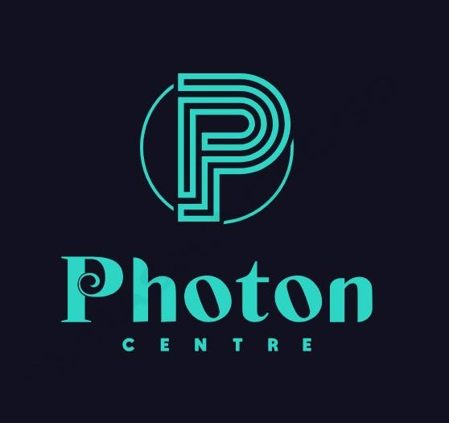

# Photon Scientific Centre for Natural Sciences and Metaphysics



## 🌟 About

The Photon Scientific Centre for Natural Sciences and Metaphysics (Photon SCNSM) is a leading scientific organization dedicated to advancing knowledge in natural sciences and metaphysics. Our mission is to foster scientific discovery, promote research collaboration, and provide educational opportunities for the global scientific community.

## 🚀 Website

- **Live Site**: [https://photoncentre.github.io/](https://photoncentre.github.io/)
- **Repository**: [https://github.com/photoncentre/photoncentre.github.io](https://github.com/photoncentre/photoncentre.github.io)

## 🛠️ Technology Stack

- **Frontend Framework**: React 18.3.1
- **Build Tool**: Vite 5.4.2
- **Routing**: React Router DOM 6.26.1
- **Styling**: Tailwind CSS 3.4.1
- **Icons**: Lucide React 0.344.0
- **Language**: TypeScript 5.5.3
- **Deployment**: GitHub Pages with gh-pages

## 📁 Project Structure

```
photoncentre/
├── public/
│   ├── media/
│   │   └── images/
│   │       ├── team/          # Team member photos
│   │       └── Photon.jpg     # Logo
│   └── index.html
├── src/
│   ├── components/
│   │   ├── Footer.tsx         # Site footer
│   │   ├── Header.tsx         # Site header
│   │   └── Navigation.tsx     # Navigation menu
│   ├── pages/
│   │   ├── Archive.tsx        # Events archive
│   │   ├── Contact.tsx        # Contact information
│   │   ├── Home.tsx           # Homepage
│   │   ├── News.tsx           # News page
│   │   ├── Programs.tsx       # Programs page
│   │   ├── Research.tsx       # Research areas
│   │   ├── Services.tsx       # Services offered
│   │   ├── Team.tsx           # Team members
│   │   └── Vision.tsx         # Vision & mission
│   ├── App.tsx                # Main app component
│   ├── main.tsx               # App entry point
│   └── index.css              # Global styles
├── package.json
├── vite.config.ts
├── tailwind.config.js
└── README.md
```

## 👥 Our Team

### Leadership
- **Dr. Elbasher M. E. Ahmed** - Founder and Director
- **Dr. Abubakr Y. A. Ibrahim** - General Manager
- **Dr. Musa A. M. Hussien** - General Consultant
- **Dr. Elaf Musa** - General Consultant

### Core Team
- **Alaa Mohammed Idris Bakhit** - Academic Coordinator
- **Ebtihal Siraj M.O.** - Communication and Designing
- **Maha M. Mousa** - Services Consultant
- **Mohammed Yahya** - Conferences & Workshops Director
- **Hazim Elshiekh** - Scientific Projects Manager
- **Gotayba A. Mohamed** - Student Activities
- **Rayan ImadEldien Hussein Elfaki** - Student Activities
- **Hiba Hassan Hashim Erwa** - Student Activities

## 🔬 Research Areas

- **Astronomy & Cosmology**
- **Theoretical Physics**
- **Materials Science**
- **Natural Sciences**
- **Metaphysics**
- **Scientific Computing**

## 🛠️ Development

### Prerequisites

- Node.js (v18 or higher)
- npm or yarn

### Installation

1. Clone the repository:
```bash
git clone https://github.com/photoncentre/photoncentre.github.io.git
cd photoncentre.github.io
```

2. Install dependencies:
```bash
npm install
```

3. Start the development server:
```bash
npm run dev
```

4. Open your browser and navigate to `http://localhost:5173`

### Available Scripts

- `npm run dev` - Start development server
- `npm run build` - Build for production
- `npm run preview` - Preview production build locally
- `npm run lint` - Run ESLint
- `npm run deploy` - Deploy to GitHub Pages
- `npm run deploy-docs` - Build and deploy to docs folder

## 🚀 Deployment

This project is automatically deployed to GitHub Pages using the `gh-pages` package.

### Deployment Methods

1. **Recommended**: Deploy using gh-pages (current setup):
```bash
npm run deploy
```

2. **Alternative**: Deploy to docs folder:
```bash
npm run deploy-docs
```

### GitHub Pages Configuration

- **Source**: Deploy from a branch
- **Branch**: `gh-pages` (automatically created by gh-pages package)
- **Folder**: `/ (root)`

## 📧 Contact

- **Email**: info3photon@gmail.com
- **Website**: [https://photoncentre.github.io/](https://photoncentre.github.io/)
- **Facebook**: [Photon SCNSM](https://www.facebook.com/PhotonSCNSM)
- **LinkedIn**: [Photon Scientific Centre](https://www.linkedin.com/company/107318450)
- **YouTube**: [Photon SCNSM](https://www.youtube.com/@PhotonSCNSM)

## 🤝 Contributing

We welcome contributions to improve our website. Please feel free to:

1. Fork the repository
2. Create a feature branch (`git checkout -b feature/amazing-feature`)
3. Commit your changes (`git commit -m 'Add some amazing feature'`)
4. Push to the branch (`git push origin feature/amazing-feature`)
5. Open a Pull Request

## 📄 License

This project is maintained by the Photon Scientific Centre for Natural Sciences and Metaphysics.

## 🔧 Technical Notes

### Styling
- Uses Tailwind CSS for utility-first styling
- Custom color scheme with blue and green theme
- Responsive design for all screen sizes
- Hover effects and smooth transitions

### Performance
- Built with Vite for fast development and optimized builds
- Code splitting with React Router
- Optimized images and assets
- Lighthouse-optimized performance

### Browser Support
- Modern browsers (Chrome, Firefox, Safari, Edge)
- Mobile-responsive design
- Progressive enhancement

---

**© 2024 Photon SCNSM. All rights reserved.**

*Advancing scientific knowledge through research, education, and collaboration.*
